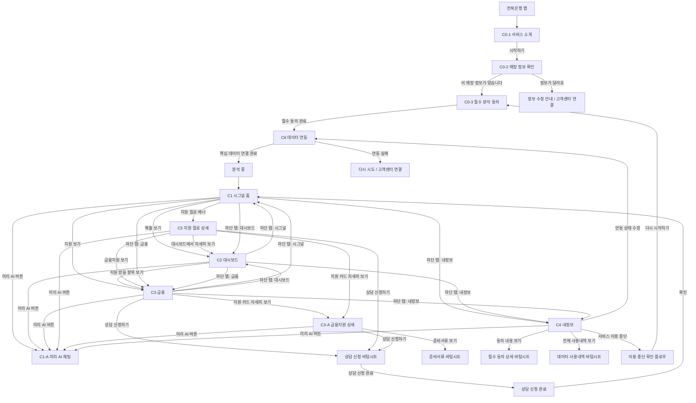

# 미리(Miri) 고객앱 전체 플로우맵 v0.1

> 작성일: 2026-06-07  
> 기준 문서: 고객앱 화면 구성 정리 v0.4  
> 목적: 고객앱 전체 화면 이동 구조를 한 장으로 파악하기 위한 플로우맵

---

## 1. 전체 화면 구조

```text
[최초 진입]
C0-1 서비스 소개
C0-2 매장 정보 확인
C0-3 필수 분석 동의
C6 데이터 연동

[하단 탭]
C1 시그널 홈
C2 대시보드
C3 금융
C4 내정보

[독립/상세]
C1-A 미리 AI 채팅
C3-A 금융지원 상세
C5 지원 필요 상세
```

---

## 2. 고객앱 전체 플로우맵



---

## 3. 핵심 플로우 요약

| 구분 | 플로우 | 목적 |
|---|---|---|
| 최초 진입 | 전북은행 앱 → C0-1 → C0-2 → C0-3 → C6 → C1 | 서비스 이해, 매장 확인, 필수 동의, 데이터 연결 |
| 평상시 확인 | C1 → C2 | 매출·원가·순익·상권 흐름 확인 |
| 지원 탐색 | C1 또는 C2 → C3 → C3-A | 맞춤 지원 확인, 조건 확인, 상담 신청 |
| 지원 필요 상황 | C1 지원 필요 배너 → C5 → C3 또는 C3-A | 불안감 없이 지원 행동으로 연결 |
| AI 질문 | C1/C2/C3/C3-A/C5/C4 → C1-A | 자연어 질문, 근거 설명, 관련 화면 이동 |
| 데이터 관리 | C4 → C6 / 동의 상세 / 사용내역 / 이용 중단 | 데이터 투명성, 동의 관리, 서비스 중단 |

---

## 4. 화면별 주요 진입/이탈

| 화면 | 들어오는 경로 | 나가는 경로 |
|---|---|---|
| C0-1 서비스 소개 | 전북은행 앱에서 미리 진입 | C0-2 |
| C0-2 매장 정보 확인 | C0-1 | C0-3 / 정보 수정 안내 |
| C0-3 필수 분석 동의 | C0-2 / C4 재시작 | C6 |
| C6 데이터 연동 | C0-3 / C4 연동 수정 | C1 / 오류 재시도 |
| C1 시그널 홈 | C6 분석 완료 / 하단 탭 | C2 / C3 / C5 / C1-A / C4 |
| C1-A 미리 AI 채팅 | AI 플로팅 버튼 / 빠른 버튼 | C2 / C3 / C3-A / C5 / C4 |
| C2 대시보드 | C1 / 하단 탭 / AI CTA | C3 / C1-A / 하단 탭 |
| C3 금융 | C1 / C2 / C5 / AI CTA | C3-A / 상담 신청 / C1-A |
| C3-A 금융지원 상세 | C3 / C5 / AI CTA | 상담 신청 / 준비서류 / C1-A |
| C5 지원 필요 상세 | C1 배너 / AI CTA / 알림 | C2 / C3 / C3-A / 상담 신청 / C1-A |
| C4 내정보 | 하단 탭 / AI CTA | C6 / 동의 상세 / 사용내역 / 이용 중단 / C1-A |

---

## 5. 미리 AI 플로팅 버튼 노출 규칙

```text
노출 시작:
C1 시그널 홈부터

노출 화면:
C1, C2, C3, C3-A, C5, C4

미노출 화면:
C0-1, C0-2, C0-3, C6, 상담 신청 입력 중
```

AI 버튼 이동:

```text
C1/C2/C3/C3-A/C5/C4
→ 미리 AI 플로팅 버튼
→ C1-A 미리 AI 채팅
```

---

## 6. 상태별 주요 분기

| 고객 상태 | C1 표시 | C1 배너 | C3 추천 방향 | C5 우선 행동 |
|---|---|---:|---|---|
| 안정 | 가게 흐름이 안정적이에요 | X | 지원금, 금리우대, 성장지원 | C5 진입 없음 |
| 관찰 | 매출 흐름을 조금 더 살펴볼 시점이에요 | X 또는 약한 안내 | 비용절감, 지원금, 컨설팅 | C5 진입 없음 |
| 주의 | 부담이 커지기 전에 점검해볼 시점이에요 | O | 만기연장, 금리감면, 보증부 정책자금, 상담 | 부담완화 보기, 맞춤 지원 확인, 상담 신청 |
| 집중지원 필요 | 지금은 도움을 받아볼 시점이에요 | O | 채무조정, 개인사업자대출119, 재기지원, 상담 | 상담 신청, 부담완화 보기, 재기지원 확인 |

---

## 7. 반드시 지켜야 할 정책

```text
1. 고객 화면에는 원시 부실확률, D등급, 위험 차주 표현을 노출하지 않는다.
2. C3는 대출추천 화면이 아니라 금융지원 트리아지 화면이다.
3. 주의 상태에서는 일반 신규대출 자동추천을 하지 않는다.
4. 집중지원 필요 상태에서는 일반 신규대출 자동권유를 하지 않는다.
5. C5는 위험 경고 화면이 아니라 지원 연결 화면이다.
6. C4에서 필수 분석 동의 철회는 단순 OFF가 아니라 서비스 이용 중단 플로우로 처리한다.
7. 리뷰 텍스트, 리뷰 감성분석, 리뷰 수는 사용하지 않는다.
8. 외부 평판 신호는 배달앱 별점 급락 등 숫자 신호만 사용한다.
```

---

## 8. 와이어프레임 제작 순서 추천

```text
1. C1 시그널 홈
2. C2 대시보드
3. C3 금융
4. C5 지원 필요 상세
5. C1-A 미리 AI 채팅
6. C3-A 금융지원 상세
7. C4 내정보
8. C0-1 서비스 소개
9. C0-2 매장 정보 확인
10. C0-3 필수 분석 동의
11. C6 데이터 연동
```
