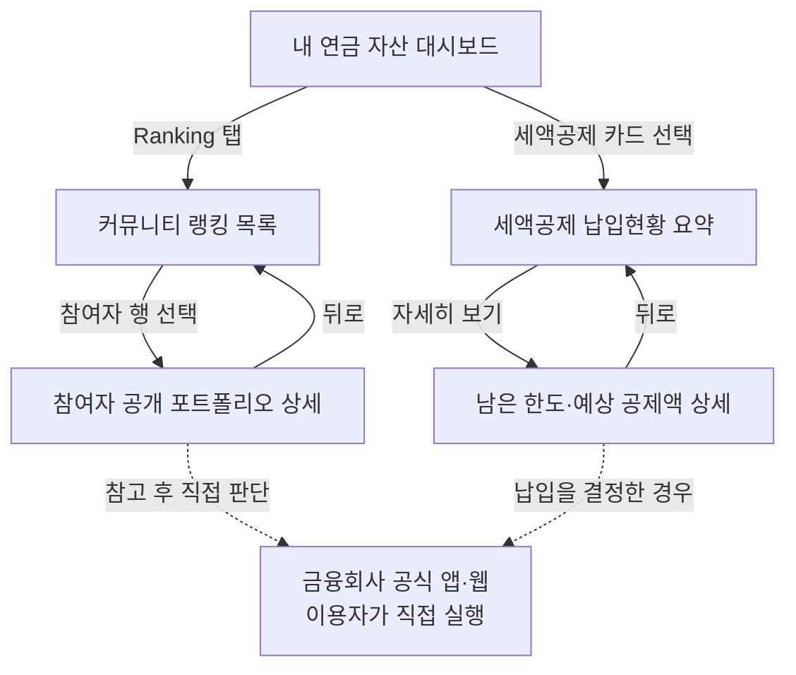

# 연금 커뮤니티 랭킹·세액공제 납입현황 기능

> 상태: 첨부 참고 화면을 바탕으로 정리한 기능 명세 초안
> 기준일: 2026-07-14
> 적용 원칙: 자문·정보 제공형 · 과거 수익률만 표시 · 계산은 규칙 기반 엔진 · 사용자·커뮤니티 계좌는 목데이터
> 상위 문서: [기획서](./기획서.md) · [화면·유저 플로우](./화면_유저플로우.md) · [연금 기초](../20_리서치/연금_기초.md) · [아키텍처](../30_스펙/아키텍처.md)

---

## 1. 기능 한 줄 정의

이용자가 다른 참여자의 **과거 연금계좌 수익률 순위와 공개 포트폴리오를 참고**하고, 자신의 **연금저축·개인형 IRP 납입액이 해당 연도 세액공제 한도에서 얼마나 채워졌는지 확인**하도록 돕는 기능이다.

두 기능은 모두 숫자만 보여주는 데서 끝나지 않고 다음 질문에 답해야 한다.

- 커뮤니티: `이 순위는 어떤 기간과 기준으로 계산됐고, 이 참여자는 어떤 자산구성을 보유했는가?`
- 세액공제: `올해 공제 대상 납입액은 얼마이고, 한도까지 얼마나 남았으며, 추가 납입 시 예상 세액공제액은 얼마인가?`

실제 상품 선택·매수·매도·납입은 서비스 밖의 금융회사 공식 채널에서 이용자가 직접 실행한다.

---

## 2. 참고 화면에서 가져올 UX 패턴

첨부된 이미지는 제품 요구사항을 구체화하기 위한 시각 참고 자료이며, 이미지에 등장하는 이용자명·수익률·자산금액·상품명은 본 프로젝트의 실제 데이터로 사용하지 않는다.

| 참고 파일 | 관찰한 패턴 | 본 기능에 반영할 내용 |
|---|---|---|
| `커뮤니티1.png` | 수익률 순·즐겨찾기 순·최신 순 탭, 순위별 수익률·손익·자산구성 막대, 즐겨찾기 | 커뮤니티 랭킹 목록과 정렬, 행 선택, 기준일 고지 |
| `커뮤니티2.jpg` | 참여자명·업데이트일·총자산·손익·수익률, 보유 상품 도넛 차트, 자산군 비중 | 참여자 포트폴리오 상세와 데이터 기준 표시 |
| `연금세제1.png` | 소득구간 선택, 올해 세액공제액, 한도 진행 막대, 계좌별 납입 현황 | 세액공제 납입현황 요약 화면 |
| `연금세제2.jpg` | 한도까지 남은 납입액과 추가 공제 가능액을 계좌별로 설명 | 세액공제 상세 화면과 교육용 채우기 시나리오 |

### 반영하지 않는 요소

- 첨부 화면의 수익률 계산법과 랭킹 모집단은 확인할 수 없으므로 그대로 사용하지 않는다.
- 참여자의 포트폴리오를 한 번에 복제하거나 주문하는 기능은 제공하지 않는다.
- 화면에 표시된 세액공제액을 실제 환급액으로 확정하지 않는다.
- 참여자 간 댓글·쪽지·개인화 투자 조언은 이번 범위에 포함하지 않는다.

---

## 3. 전체 사용자 흐름



---

## 4. 기능 A — 커뮤니티 수익률 랭킹

### 4.1 목적

공개에 동의한 참여자의 연금 포트폴리오를 동일한 기준으로 비교해, 이용자가 다양한 자산구성 사례를 탐색하도록 돕는다. 랭킹은 성과를 보장하거나 상위 참여자를 그대로 따라 하도록 유도하는 장치가 아니라 **과거 운용 사례를 발견하는 탐색 도구**다.

### 4.2 랭킹 목록 화면

#### 상단 영역

- 화면명: `연금 포트폴리오`
- 정렬 탭:
  - `수익률 순`: 선택한 비교 기간의 과거 수익률 내림차순
  - `즐겨찾기 순`: 즐겨찾기 수 내림차순
  - `최신 순`: 포트폴리오 기준일 내림차순
- 선택 필터: 계좌 유형, 연령대, 투자성향, 비교 기간
- 자산군 범례: 주식형, 채권형, 원리금보장·현금성, 기타 등 프로젝트 표준 분류
- 고정 안내: `공개 포트폴리오는 {기준일}까지 업데이트된 목데이터입니다.`

#### 참여자 행

| 요소 | 설명 |
|---|---|
| 순위 | 현재 정렬·필터 조건에서의 순위 |
| 닉네임 | 실명 대신 데모용 닉네임 사용 |
| 신규 표시 | 최초 공개 또는 최근 업데이트 여부 |
| 과거 손익 | 비교 기간의 평가손익 금액 |
| 과거 수익률 | 동일 산정 방식으로 계산한 비교 기간 수익률 |
| 자산구성 막대 | 자산군별 비중을 100% 누적 막대로 표시 |
| 즐겨찾기 | 이용자가 다시 볼 참여자를 저장하는 기능 |
| 기준일 | 행 또는 상세 진입 전 확인 가능한 위치에 표시 |

행 전체를 선택하면 해당 참여자의 포트폴리오 상세 화면으로 이동한다. 별 아이콘 선택은 상세 이동 없이 즐겨찾기 상태만 변경한다.

### 4.3 랭킹 산정 원칙

- 모든 참여자는 **같은 비교 기간·같은 수익률 산식·같은 평가 시점**으로 비교한다.
- 수익률은 과거 실적만 사용하며 `기간 수익률`, `산정 기간`, `기준일`, `데이터 성격`을 함께 표시한다.
- 납입·인출 시점이 다른 계좌를 단순 손익률로 비교하면 왜곡될 수 있다. MVP의 공식 랭킹 산식은 엔진 스펙 확정 후 사용한다.
- 수익률이 같으면 기준일 최신 순, 그다음 닉네임의 내부 정렬키 순으로 안정 정렬한다.
- 데이터가 오래됐거나 필수 값이 누락된 참여자는 순위에서 제외하고 제외 이유를 표시한다.
- 극단적 수익률도 임의로 삭제하지 않되, 산식 오류·비정상 입력 검증을 통과한 데이터만 노출한다.

> TODO: 확인 필요 — 금액가중수익률과 시간가중수익률 중 커뮤니티 비교에 사용할 공식 산식, 최소 공개 기간, 최소 잔액, 동률 처리의 최종 기준.

대표 고객 6명 시연에서는 공식 랭킹 산식 확정 전까지 순위를 생성하지 않는다. 대신
`accounts.csv`의 동일한 2025년 과거 12개월 합성수익률을 계좌잔액으로 가중한 값을
`화면 표시용 참고값`으로 제공한다. 추천(좋아요) 수는 수익률과 무관한 합성값으로
배정하며, 두 지표의 SSOT는 `data/mock/demo_public_portfolio_metrics.json`이다.

### 4.4 참여자 포트폴리오 상세 화면

#### 프로필 요약

- 닉네임
- 포트폴리오 기준일과 마지막 업데이트 시각
- 즐겨찾기 버튼과 즐겨찾기 수
- 공개 범위 및 `목데이터` 칩

#### 성과 요약

- 총 연금자산
- 비교 기간 평가손익
- 비교 기간 수익률
- 계산 기준·기간·기준일·출처 칩

#### 포트폴리오 구성

- 상품별 비중 도넛 차트
- 상품명, 상품 유형, 계좌 유형, 평가금액, 비중
- 자산군별 합산 비중 막대
- DC형·IRP·연금저축을 보유한 경우 계좌별 탭 또는 구분 칩
- 현금성 자산과 기타 자산을 생략하지 않고 0% 항목도 필요 시 명시

#### 해석 안내

- `이 구성과 수익률은 과거 목데이터이며 미래 성과를 보장하지 않습니다.`
- `나의 투자성향·기간·계좌 규칙과 다를 수 있습니다.`
- `DC형·IRP의 위험자산 규칙과 연금저축의 상품 적격성 규칙은 서로 다릅니다.`
- 특정 상품을 매수·매도하라는 문구와 서비스 내 주문 버튼은 두지 않는다.

### 4.5 계좌 규칙 표시

참여자의 여러 계좌를 하나의 차트로 합산해 보여줄 수 있지만, 규칙 준수 여부는 반드시 계좌별로 판정한다.

- DC형·IRP: 일반 위험자산 70% 한도와 법정 예외를 별도 판정
- 연금저축펀드: 동일한 위험자산 총량 한도를 적용하지 않고 상품 적격성 규칙 적용
- 통합 차트: 전체 자산구성 탐색용이며 특정 계좌의 한도 판정 근거로 사용하지 않음

### 4.6 빈 화면·오류 상태

| 상태 | 화면 처리 |
|---|---|
| 공개 참여자 없음 | 필터 초기화와 데이터 준비 중 안내 |
| 필터 결과 없음 | 현재 조건을 보여주고 필터 해제 버튼 제공 |
| 수익률 계산 불가 | 순위 제외, `계산에 필요한 데이터 부족` 표시 |
| 오래된 포트폴리오 | 기준일 경고 칩 표시, 최신 순에서 후순위 처리 |
| 상품 분류 미확정 | `기타`로 표시하고 `TODO: 분류 확인 필요` 로그 생성 |
| 네트워크 오류 | 마지막 정상 조회 시각과 다시 시도 버튼 제공 |

---

## 5. 기능 B — 연금계좌 세액공제 납입현황

### 5.1 목적

이용자가 선택한 귀속연도의 연금저축·개인형 IRP 납입액을 세액공제 대상 한도와 비교해, 현재까지 채운 금액과 남은 공제 여지를 이해하도록 돕는다.

이 화면은 납입 권유나 세무 확정 서비스가 아니다. 화면의 세액공제액은 규칙 엔진이 입력값과 기준연도 규칙으로 계산한 **예상치**이며, 최종 공제액·환급액은 개인의 과세 상황과 연말정산 결과에 따라 달라질 수 있다.

### 5.2 2026년 화면에 적용할 기본 규칙

| 항목 | 기준 | 화면의 출처 칩 |
|---|---:|---|
| 연금저축 세액공제 대상 한도 | 연 600만원 | `국세청 · 2026 확인` |
| 연금저축+퇴직연금계좌 합산 한도 | 연 900만원 | `국세청 · 2026 확인` |
| 총급여 5,500만원 이하 공제율 | 15% (지방소득세 포함 효과 16.5%) | `국세청 · 소득구간` |
| 총급여 5,500만원 초과 공제율 | 12% (지방소득세 포함 효과 13.2%) | `국세청 · 소득구간` |

종합소득자는 총급여 대신 종합소득금액 기준을 적용한다. 현재 국세청 안내의 경계는 종합소득금액 4,500만원이다. 근로소득과 종합소득의 입력 분기는 규칙 엔진에서 구분한다.

공식 근거:

- [국세청 — 근로소득·연금계좌 세액공제](https://www.nts.go.kr/nts/cm/cntnts/cntntsView.do?cntntsId=7875&mi=6596)
- [기획재정부 — 연금계좌 세제혜택 확대](https://whatsnew.moef.go.kr/mec/ots/dif/view.do?comBaseCd=DIFGODEPRT&difGovDepart1=DIFGODR001&difSer=218733df-91c4-4698-bdeb-941b448c0cfa&temp=2023&temp2=HALF001)
- [금융위원회 — 2025년 연금저축 투자 백서](https://fsc.go.kr/no010101/87144?curPage=4&srchBeginDt=&srchCtgry=&srchEndDt=&srchKey=&srchText=)

> 규칙은 `taxRuleYear=2026`처럼 기준연도별 데이터로 관리한다. 화면 문구에 숫자를 직접 고정하지 않는다.

### 5.3 납입현황 요약 화면

#### 상단 요약

- 제목: `{귀속연도} 연금 세액공제 예상액`
- 현재 예상 세액공제액
- 적용 소득 유형·소득구간 선택 또는 수정 버튼
- 마지막 납입 데이터 기준일과 새로고침 버튼
- `목데이터`와 `예상치` 칩

#### 진행 카드

- 합산 공제 대상 납입액 / 합산 한도
- 한도 충족률 진행 막대
- 연금저축 납입액과 공제 대상 인정액
- 개인형 IRP 납입액과 공제 대상 인정액
- 한도 초과 납입액이 있으면 공제 대상분과 초과분을 분리 표시
- `자세히 보기` 버튼

진행률의 분모는 예상 세액공제액이 아니라 **합산 공제 대상 납입 한도**다. 예를 들어 공제 대상 납입액이 450만원이면 진행률은 `450만원 / 900만원 = 50%`로 계산한다.

### 5.4 남은 한도 상세 화면

상단에는 `올해 공제 대상 한도까지 {남은 금액}이 남아 있어요`와 같이 현재 상태를 설명한다. 확정 환급으로 오해하지 않도록 `더 환급받아요` 대신 `예상 세액공제액이 최대 {금액} 늘어날 수 있어요`를 사용한다.

계좌별 행은 다음 정보를 제공한다.

| 계좌 | 표시 내용 |
|---|---|
| 연금저축 | 현재 납입액, 공제 대상 인정액, 연금저축 단독 한도까지 남은 금액, 해당 금액을 채우는 교육용 시나리오의 예상 추가 공제액 |
| 개인형 IRP | 현재 납입액, 공제 대상 인정액, 합산 한도까지 남은 금액, 해당 금액을 채우는 교육용 시나리오의 예상 추가 공제액 |

기본 교육용 시나리오는 `연금저축의 단독 한도까지 확인 → 합산 한도의 남은 부분을 IRP에서 확인`하는 순서로 보여준다. 이는 상품 추천이 아닌 **한도 구조 설명용 예시**이며, 이용자는 계좌별 가상 납입액을 바꿔 결과를 비교할 수 있다.

### 5.5 계산 규칙

아래 계산은 모두 규칙 기반 엔진이 수행하고, LLM과 화면은 결과를 그대로 설명한다.

```text
pensionSavingsEligible = min(max(pensionSavingsPaid, 0), 6,000,000)

combinedPaid = pensionSavingsEligible + max(irpPersonalPaid, 0)
combinedEligible = min(combinedPaid, 9,000,000)

remainingCombinedLimit = max(9,000,000 - combinedEligible, 0)
remainingSavingsLimit = max(
  min(6,000,000 - pensionSavingsEligible, remainingCombinedLimit),
  0
)

taxCreditRateWithLocalTax =
  incomeBracket == LOWER ? 0.165 : 0.132

estimatedTaxCredit = combinedEligible * taxCreditRateWithLocalTax
estimatedAdditionalTaxCredit = scenarioAdditionalEligible * taxCreditRateWithLocalTax

progressRate = combinedEligible / 9,000,000
```

#### 계산 시 주의사항

- 개인형 IRP에서는 퇴직급여 이전액과 개인 추가납입액을 구분한다. 세액공제 대상 계산에는 해당 연도의 공제 대상 개인 납입액만 사용한다.
- 회사가 납입한 DC형 사용자부담금은 이용자 세액공제 대상 납입액에 포함하지 않는다.
- 연금저축 납입액이 600만원을 넘더라도 연금저축 공제 대상 인정액은 600만원을 넘지 않는다.
- 연금저축과 IRP의 합산 공제 대상 인정액은 900만원을 넘지 않는다.
- 실제 세액공제는 결정세액 등 개인별 과세 상황의 영향을 받으므로 `예상 세액공제액`과 `예상 환급액`을 같은 의미로 사용하지 않는다.
- ISA 만기자금 전환 등 추가한도는 기본 화면에서 자동 가정하지 않는다. 해당 조건을 구현할 때 별도 입력·규칙·출처 칩을 추가한다.

### 5.6 예시

총급여 5,500만원 이하인 근로자가 연금저축 600만원과 개인형 IRP 300만원을 공제 대상 개인 납입금으로 입력한 경우:

| 항목 | 엔진 결과 |
|---|---:|
| 합산 공제 대상 납입액 | 900만원 |
| 한도 진행률 | 100% |
| 적용 공제 효과율 | 16.5% |
| 예상 세액공제액 | 148만 5,000원 |

총급여 5,500만원 초과 구간이면 같은 공제 대상 납입액에 13.2%를 적용해 예상 세액공제액은 118만 8,000원이다.

> 위 예시는 제도 구조를 설명하기 위한 계산 예시다. 실제 환급액을 보장하지 않는다.

### 5.7 빈 화면·오류 상태

| 상태 | 화면 처리 |
|---|---|
| 연결된 연금저축·IRP 없음 | 데모 자산 선택 또는 목데이터 불러오기 안내 |
| 납입액 0원 | 0% 진행률과 계좌별 한도 구조 설명 |
| 일부 납입 | 현재 인정액·남은 한도·예상 추가 공제액 표시 |
| 합산 한도 충족 | 100% 표시, 추가 납입이 세액공제를 늘리지 않을 수 있음을 안내 |
| 한도 초과 납입 | 공제 대상분과 초과분을 분리해 표시 |
| 소득구간 미입력 | 공제율별 범위를 먼저 표시하고 소득구간 입력 요청 |
| 기준연도 규칙 없음 | 계산 중단 후 `TODO: 해당 연도 세제 규칙 확인 필요` 표시 |
| 납입 데이터 갱신 실패 | 마지막 정상 기준일과 다시 시도 버튼 표시 |

---

## 6. 데이터와 엔진 책임

### 6.1 데이터 경계

| 데이터 | MVP 구분 | 용도 |
|---|---|---|
| 세액공제 한도·공제율 | 공식 공개 실데이터 | 기준연도별 세제 규칙 |
| 상품·자산군 분류 | 공식 공개 실데이터 + 프로젝트 표준 분류 | 포트폴리오 표시와 계좌 규칙 검사 |
| 현재 이용자 납입액·계좌 | 시나리오 목데이터 | 세액공제 진행률 계산 |
| 커뮤니티 참여자·수익률·포트폴리오 | 시나리오 목데이터 | 랭킹과 상세 화면 시연 |
| 즐겨찾기 | 데모 세션 상태 | 정렬·저장 UX 시연 |

실서비스 전환 시에는 계좌 연동 권한, 공개 동의, 닉네임·재식별 위험, 철회·삭제, 신고·검수 정책을 별도로 설계한다.

### 6.2 엔진 출력 예시

#### 커뮤니티 랭킹

```json
{
  "comparisonPeriod": "TODO",
  "returnMethod": "TODO",
  "asOf": "2026-07-13",
  "dataKind": "MOCK",
  "participants": [
    {
      "rank": 1,
      "participantId": "mock-user-001",
      "nickname": "연금새싹",
      "periodReturnRate": 0.1234,
      "periodProfitLoss": 1234000,
      "assetClassWeights": {
        "equity": 0.55,
        "bond": 0.25,
        "principalProtectedOrCash": 0.20
      }
    }
  ]
}
```

#### 세액공제 납입현황

```json
{
  "taxRuleYear": 2026,
  "incomeType": "SALARY",
  "incomeBracket": "LOWER",
  "pensionSavingsPaid": 6000000,
  "irpPersonalPaid": 3000000,
  "combinedEligible": 9000000,
  "remainingCombinedLimit": 0,
  "taxCreditRateWithLocalTax": 0.165,
  "estimatedTaxCredit": 1485000,
  "asOf": "2026-07-14",
  "dataKind": "MOCK",
  "sourceChips": [
    "국세청·연금계좌 세액공제",
    "사용자 계좌·목데이터"
  ]
}
```

### 6.3 LLM 책임

- 엔진이 반환한 순위·수익률·납입액·한도·예상 세액공제액만 자연어로 설명한다.
- 직접 수익률, 진행률, 남은 한도, 예상 세액공제액을 계산하지 않는다.
- 수치와 함께 기준일·산식·가정·출처 칩을 누락하지 않는다.
- 참여자 포트폴리오와 이용자 성향이 다를 수 있음을 설명한다.
- 미래 성과·실제 환급액을 확정하거나 특정 상품 거래를 지시하지 않는다.

---

## 7. 화면 공통 원칙

- 금액은 원 단위 원본을 보존하고 화면에서만 `만원` 등 읽기 쉬운 단위로 변환한다.
- 비중의 합은 반올림 전 원본 기준 100%인지 검증한다.
- 빨강·파랑 같은 색만으로 수익·손실이나 상태를 구분하지 않고 부호·텍스트를 함께 사용한다.
- 모든 수익률에는 비교 기간과 기준일을, 모든 세액공제 수치에는 귀속연도와 소득구간을 표시한다.
- 목데이터, 공식 실데이터, 이용자 입력을 서로 다른 칩으로 구분한다.
- 차트 항목은 범례와 동일한 순서로 읽히며 스크린리더용 대체 텍스트를 제공한다.
- 즐겨찾기, 필터, 새로고침, 뒤로 가기는 모바일 터치 영역을 충분히 확보한다.

---

## 8. 완료 조건

### 커뮤니티

- [ ] 수익률 순·즐겨찾기 순·최신 순 정렬이 각각 정의된 기준대로 동작한다.
- [ ] 참여자 선택 시 동일한 참여자의 상세 포트폴리오가 열린다.
- [ ] 목록과 상세의 수익률·손익·기준일이 일치한다.
- [ ] 상품별 비중 합과 자산군별 비중 합이 각각 100%다.
- [ ] DC형·IRP와 연금저축의 계좌 규칙을 혼합하지 않는다.
- [ ] 과거 실적·기준일·목데이터·미래 성과 비보장 문구가 노출된다.
- [ ] 서비스 안에 포트폴리오 일괄 복제 또는 주문 버튼이 없다.

### 세액공제

- [ ] 연금저축 공제 대상 인정액이 600만원을 초과하지 않는다.
- [ ] 연금저축+IRP 합산 공제 대상 인정액이 900만원을 초과하지 않는다.
- [ ] 소득구간별 16.5%·13.2% 계산 결과가 엔진 테스트와 일치한다.
- [ ] IRP 퇴직급여 이전액과 세액공제 대상 개인 납입액이 분리된다.
- [ ] 한도 미달·충족·초과 상태가 각각 올바르게 표시된다.
- [ ] 예상 세액공제액을 실제 환급 보장으로 표현하지 않는다.
- [ ] 귀속연도·기준일·소득구간·공식 출처·목데이터 칩이 표시된다.

---

## 9. 미확정 사항

- [ ] 커뮤니티 공식 수익률 산식과 비교 기간
- [ ] 랭킹 모집단, 최소 공개 기간·잔액, 이상치 검증 기준
- [ ] 계좌별 상품명 공개 범위와 참여자 재식별 방지 기준
- [ ] 즐겨찾기와 팔로우를 하나의 기능으로 합칠지 여부
- [ ] 포트폴리오 상세에서 개별 계좌와 통합 보기의 기본 탭
- [ ] 세액공제 화면 진입 위치: 대시보드 카드 vs Profile 메뉴
- [ ] 종합소득자 입력 UX와 소득구간 확인 방식
- [ ] ISA 만기자금 전환 등 추가한도 지원 범위
- [ ] 기준연도별 세제 규칙 갱신·검수 담당자와 배포 절차
