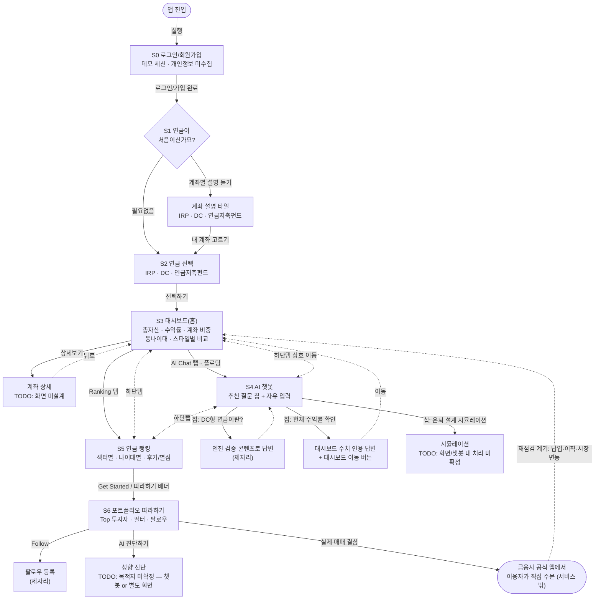
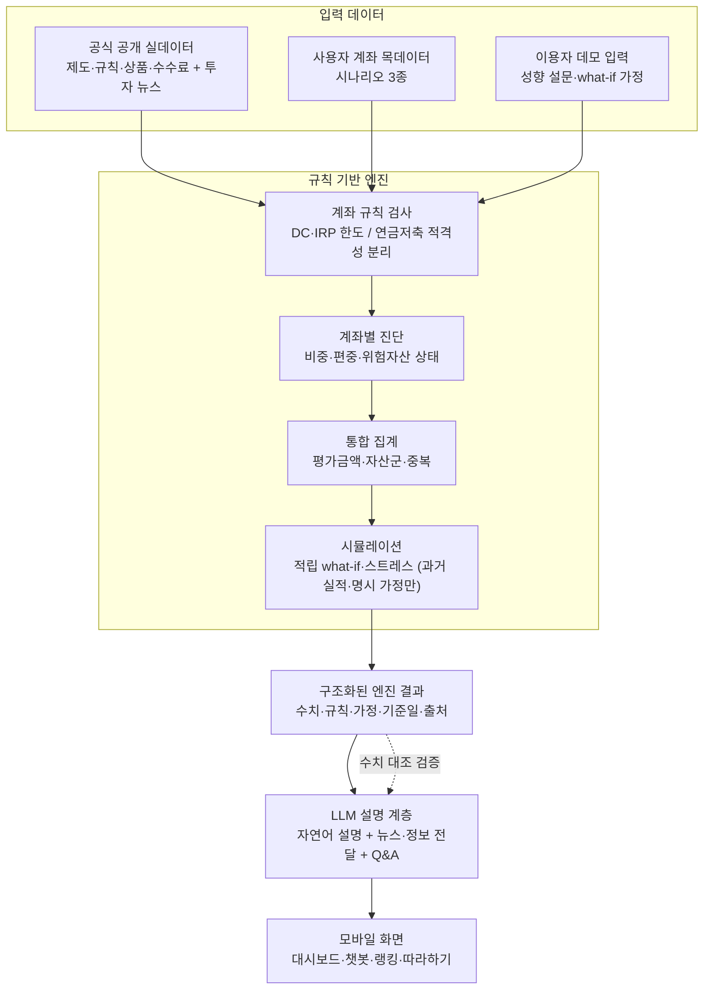
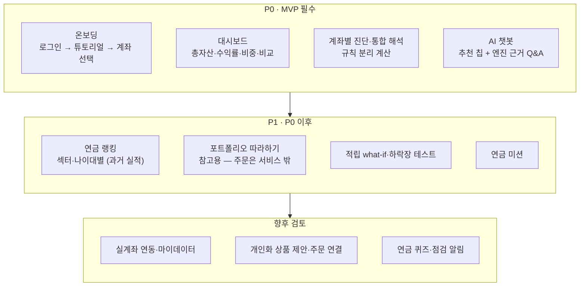

# 화면 · 유저 플로우

> 기준: **Figma 확정 화면**(rezero 페이지 5화면 + 로그인 초안 + 연금 설명 튜토리얼) · [프로젝트 기획서](./기획서.md) v2.2 · 2026-07-14 자문·정보 제공형 전환 반영
> 표기: 진입=타원 · 화면=사각형 · 결정=다이아몬드 · 종료=이중원 · 점선=보조/이탈 흐름. 화살표엔 트리거(버튼)를 붙인다.

## 1. 화면 목록

| # | 화면 | Figma | 핵심 요소 | 상태 |
|---|---|---|---|---|
| S0 | 로그인/회원가입 | 초안 | 회원가입·로그인 버튼 (데모 세션) | 초안만, 정교화 전 |
| S1 | 연금 설명 튜토리얼 | 확정 | "연금이 처음이신가요?" → 계좌별 설명 듣기 / 필요없음, IRP·DC·연금저축펀드 설명 타일 | 골격 확정, 설명 문구 TODO |
| S2 | 연금 선택 | 확정 | IRP·DC·연금저축펀드 선택 + 선택하기 | 확정 |
| S3 | 내 연금 자산 대시보드 (홈) | 확정 | 연금 미션 배너 · 총자산·수익률·계좌 비중(상세보기) · 동나이대 수익률 비교 · 투자 스타일별 수익률 | 확정 |
| S4 | 연금 AI 어시스턴트 챗봇 | 확정 | 추천 질문 칩 3종 · 자유 입력 · 플로팅 진입 | 확정 |
| S5 | 연금 랭킹 및 수익률 비교 | 확정 | 후기/별점 · 섹터별/나이대별 랭킹 표 · 포트폴리오 따라하기 배너 · Weekly Market Analysis | 확정 |
| S6 | 연금 포트폴리오 따라하기 | 확정 | Top 투자자 카드(과거 수익률·위험지수·구성) · 필터 · 추천 투자자 팔로우 · AI 진단하기 | 확정 |

하단탭(공통): `Dashboard(S3) · Ranking(S5) · AI Chat(S4) · Profile`
> `TODO: 확인 필요` — S2(연금 선택) 프레임만 하단탭이 `Follow`로 다름(구버전 잔재로 추정). Profile 화면 미설계.

## 2. 전체 유저 플로우

**플로우 원칙**
- S0~S2는 온보딩 일방향, S3~S6은 하단탭 순환 구조.
- 서비스 안에 주문 버튼 없음 — 실행은 항상 서비스 밖(금융사 앱)에서 이용자가 직접.
- 수익률 표시는 전부 과거 실적 + 기준일. 미래 수익 단정 문구 금지.

## 3. 챗봇 추천 질문 칩 — 분기 규칙

| 칩 | 처리 | 이동 |
|---|---|---|
| DC형 연금이란? | 검증 콘텐츠 기반 설명 | 챗봇 내 (제자리) |
| 현재 수익률 확인하기 | 엔진이 계산한 목계좌 수익률 인용 | 제자리 답변 + 대시보드 이동 버튼 |
| 은퇴 설계 시뮬레이션 | 엔진 what-if 실행 | `TODO: 확인 필요` — 챗봇 내 결과 표시 vs 별도 시뮬 화면 |

칩 외 자유 질문은 엔진 근거 범위 검사 → 범위 밖이면 답변 보류 + 한계 안내(가드레일).

## 4. 데이터 · 엔진 · AI 처리 흐름

## 5. 기능 우선순위

## 6. 미확정 (TODO — 지어내지 말 것)

- [ ] S2 하단탭 `Follow` vs 나머지 화면 `AI Chat` — 최종 탭 구성 확정
- [ ] "은퇴 설계 시뮬레이션" 칩의 목적지 (챗봇 내 vs 별도 화면)
- [ ] "AI 진단하기" 버튼 목적지 (챗봇 vs 별도 진단 화면)
- [ ] S3 "상세보기" → 계좌 상세 화면 설계
- [ ] Profile 탭 화면 설계
- [ ] 로그인 화면 정교화 (초안만 존재)
