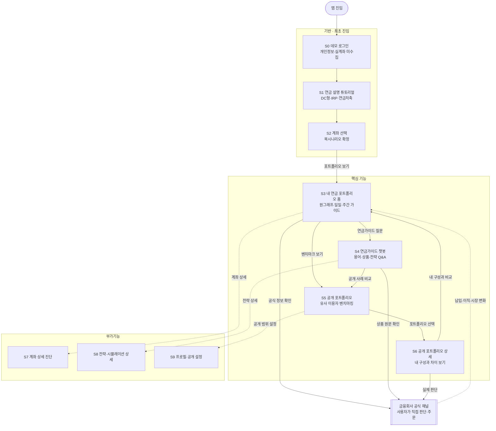
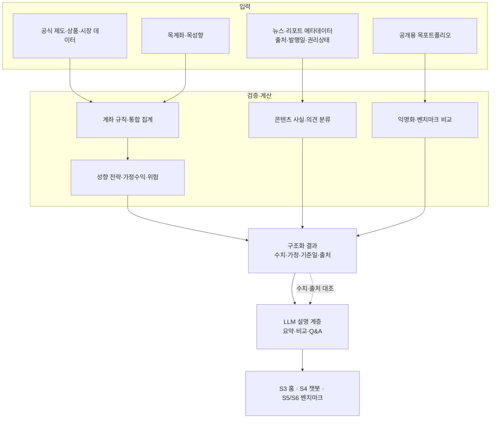
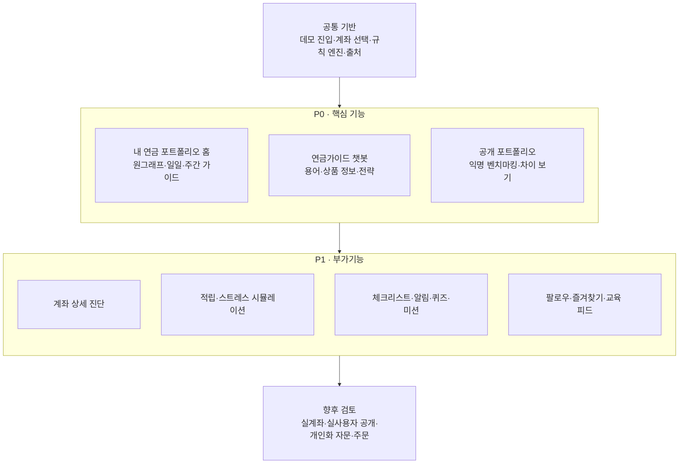

# 화면 · 유저 플로우

> 기준: [프로젝트 기획서](./기획서.md) v2.3 · 2026-07-14 핵심 기능 재정의 반영
>
> 핵심 기능: **내 연금 포트폴리오 홈 · 연금가이드 챗봇 · 공개 포트폴리오 벤치마킹**

## 1. 화면 목록

| ID | 화면 | 구분 | 핵심 요소 | 상태 |
|---|---|---|---|---|
| S0 | 데모 로그인 | 기반 | 데모 시작, 개인정보·실계좌 미수집 고지 | 초안 |
| S1 | 연금 설명 튜토리얼 | 기반 | DC형·IRP·연금저축 설명 | 기존 화면 활용 |
| S2 | 연금계좌 선택 | 기반 | 보유 계좌 조합·목시나리오 선택 | 기존 화면 활용 |
| S3 | 내 연금 포트폴리오 홈 | **핵심** | 통합 원그래프·일일 가이드·주간 매크로 전망 | 개편 필요 |
| S4 | 연금가이드 챗봇 | **핵심** | 용어·상품 비교, 종목·상품 정보, 전략·가정수익 범위 | 개편 필요 |
| S5 | 공개 포트폴리오 목록 | **핵심** | 유사 이용자 필터·익명 카드·내 구성과 차이 보기 | 위치 확정 필요 |
| S6 | 공개 포트폴리오 상세 | **핵심** | 자산군 비중·위험·과거 기간수익률·공개자 설명 | 기존 따라하기 화면 개편 |
| S7 | 계좌 상세 진단 | 부가 | 계좌별 비중·편중·한도·중복 | 미설계 |
| S8 | 전략·시뮬레이션 상세 | 부가 | 전략 근거·가정수익·손실 시나리오 | 미설계 |
| S9 | 프로필·공개 설정 | 부가/운영 | 성향·공개 동의·마스킹 범위·차단 목록 | 미설계 |

권장 하단 탭: `홈(S3) · 연금가이드(S4) · 벤치마크(S5) · 프로필(S9)`

> 공개 포트폴리오는 핵심 기능이므로 전용 `벤치마크` 탭을 우선안으로 둔다. 최종 위치는 Figma 확정 전 `TODO: 확인 필요`다.

## 2. 전체 유저 플로우

## 3. 핵심 화면별 분기

### 3.1 S3 내 연금 포트폴리오 홈

| 영역 | 사용자 행동 | 이동·결과 |
|---|---|---|
| 포트폴리오 원그래프 | 자산군·계좌 비중 선택 | 세부 수치 표시, 필요 시 S7 |
| 오늘의 가이드 | 점검 카드 선택 | 근거·시장 일정·출처 펼침 |
| 주간 매크로 전망 | 시나리오 선택 | 상승·기준·하락 영향 비교 |
| 연금가이드 질문 | 질문 시작 | S4 |
| 공개 포트폴리오 비교 | 벤치마크 선택 | S5 |

### 3.2 S4 연금가이드 챗봇

| 질문 유형 | 처리 | 필수 표시 |
|---|---|---|
| 연금 용어·상품 특징 비교 | 검증 콘텐츠와 계좌 규칙 조회 | 정의·위험·비용·계좌 적격성·출처 |
| 종목·상품 투자의견 정보 | 뉴스·리포트 검색 후 사실·외부 의견·위험 분리 | 발행기관·발행일·원문·정보 지연 |
| 성향 기반 전략 | 성향·기간·계좌 규칙 엔진 호출 | 자산군 전략·근거·가정수익 범위·손실 시나리오 |
| 범위 밖 질문 | 답변 제한 | 한계 안내·공식 채널 |

### 3.3 S5·S6 공개 포트폴리오

| 단계 | 사용자 행동 | 결과 |
|---|---|---|
| 탐색 | 계좌 조합·연령대·성향·기간 필터 | 익명 공개 포트폴리오 목록 |
| 상세 | 포트폴리오 카드 선택 | 비중·위험·과거 기간수익률·설명 |
| 비교 | `내 포트폴리오와 차이 보기` | 자산군별 차이와 점검 질문 |
| 공개 설정 | 내 공개 범위 관리 | S9, 기본 비공개·동의 철회 가능 |

`복사 주문`, `그대로 따라하기`, `수익률 1위 자동 추천`은 제공하지 않는다.

## 4. 데이터·엔진·AI 처리 흐름

## 5. 기능 우선순위

## 6. 미확정

- [ ] 공개 포트폴리오 전용 `벤치마크` 탭 최종 확정
- [ ] 기존 Figma `Ranking`·`따라하기` 화면의 명칭과 CTA 개편
- [ ] 홈 일일 가이드의 갱신 시각·휴장일 처리
- [ ] 주간 전망의 기간·출처 기관·시나리오 기준
- [ ] 뉴스·애널리스트 리포트 API와 이용 권한
- [ ] 챗봇 검색 대상 종목·상품 범위
- [ ] 성향 전략과 가정수익률 기준표
- [ ] 공개 필드·금액 구간·게시 지연·신고 정책
- [ ] S7·S8·S9 상세 화면 설계
