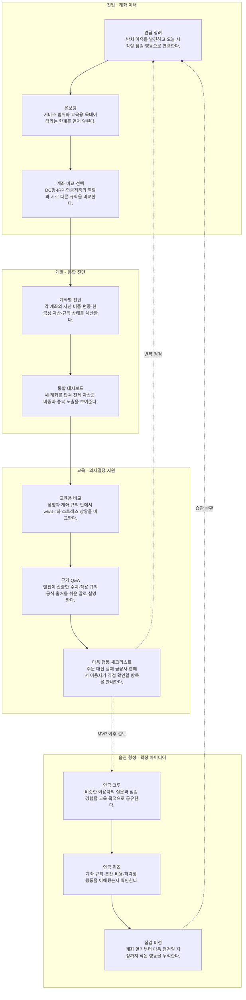
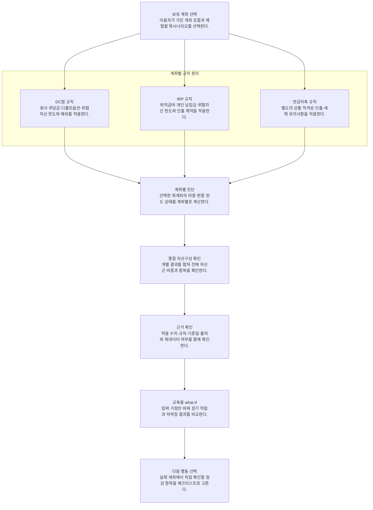
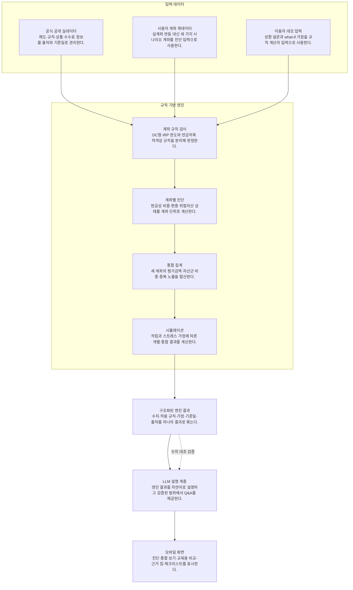
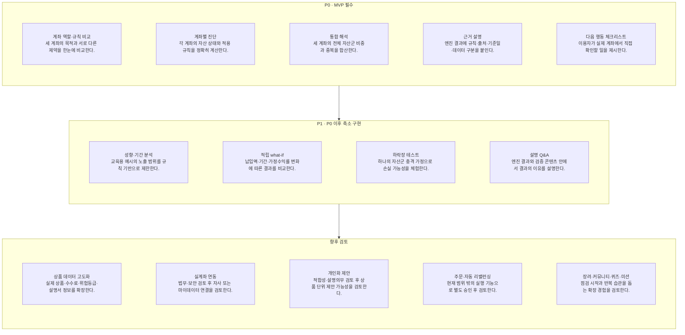

# 연금 서비스 기능 구조와 흐름

> 기준: `연금계좌_운용가이드_프로젝트_기획서.md` v2.1 · 확장 아이디어: `보다_가까워지는_연금_서비스_개요.md`

## 1. 전체 기능 구조

```mermaid
%%{init: { "flowchart": { "padding": 38, "nodeSpacing": 125, "rankSpacing": 125, "inheritDir": true } } }%%
flowchart TB
    subgraph ENTRY["진입 · 계좌 이해"]
        direction TB
        A["연금 장려<br/>방치 이유를 발견하고 오늘 시작할 점검 행동으로 연결한다."]
        B["온보딩<br/>서비스 범위와 교육용·목데이터라는 한계를 먼저 알린다."]
        C["계좌 비교·선택<br/>DC형·IRP·연금저축의 역할과 서로 다른 규칙을 비교한다."]
    end

    subgraph DIAGNOSIS["개별 · 통합 진단"]
        direction TB
        D["계좌별 진단<br/>각 계좌의 자산 비중·편중·현금성 자산·규칙 상태를 계산한다."]
        E["통합 대시보드<br/>세 계좌를 합쳐 전체 자산군 비중과 중복 노출을 보여준다."]
    end

    subgraph LEARNING["교육 · 의사결정 지원"]
        direction TB
        F["교육용 비교<br/>성향과 계좌 규칙 안에서 what-if와 스트레스 상황을 비교한다."]
        G["근거 Q&A<br/>엔진이 산출한 수치·적용 규칙·공식 출처를 쉬운 말로 설명한다."]
        H["다음 행동 체크리스트<br/>주문 대신 실제 금융사 앱에서 이용자가 직접 확인할 항목을 안내한다."]
    end

    subgraph HABIT["습관 형성 · 확장 아이디어"]
        direction TB
        I["연금 크루<br/>비슷한 이용자의 질문과 점검 경험을 교육 목적으로 공유한다."]
        J["연금 퀴즈<br/>계좌 규칙·분산·비용·하락장 행동을 이해했는지 확인한다."]
        K["점검 미션<br/>계좌 열기부터 다음 점검일 지정까지 작은 행동을 누적한다."]
    end

    A --> B --> C --> D --> E --> F --> G --> H
    H -. 반복 점검 .-> A
    H -. MVP 이후 검토 .-> I
    I --> J --> K
    K -. 습관 순환 .-> A
```

## 2. MVP 사용자 골든패스

```mermaid
%%{init: { "flowchart": { "padding": 38, "nodeSpacing": 125, "rankSpacing": 125, "inheritDir": true } } }%%
flowchart TB
    A["보유 계좌 선택<br/>이용자가 가진 계좌 조합과 체험할 목시나리오를 선택한다."]

    subgraph ACCOUNTS["계좌별 규칙 분리"]
        direction TB
        B1["DC형 규칙<br/>회사 부담금·디폴트옵션·위험자산 한도와 예외를 적용한다."]
        B2["IRP 규칙<br/>퇴직급여·개인 납입금·위험자산 한도와 인출 제약을 적용한다."]
        B3["연금저축 규칙<br/>별도의 상품 적격성·인출·세제 유의사항을 적용한다."]
    end

    C["계좌별 진단<br/>선택한 목계좌의 비중·편중·한도 상태를 계좌별로 계산한다."]
    D["통합 자산구성 확인<br/>개별 결과를 합쳐 전체 자산군 비중과 중복을 확인한다."]
    E["근거 확인<br/>적용 수치·규칙·기준일·출처와 목데이터 여부를 함께 확인한다."]
    F["교육용 what-if<br/>입력 가정만 바꿔 장기 적립과 하락장 결과를 비교한다."]
    G["다음 행동 선택<br/>실제 계좌에서 직접 확인할 점검 항목을 체크리스트로 고른다."]

    A --> B1
    A --> B2
    A --> B3
    B1 --> C
    B2 --> C
    B3 --> C
    C --> D --> E --> F --> G
```

## 3. 데이터 · 엔진 · AI 처리 흐름

```mermaid
%%{init: { "flowchart": { "padding": 38, "nodeSpacing": 125, "rankSpacing": 125, "inheritDir": true } } }%%
flowchart TB
    subgraph INPUT["입력 데이터"]
        direction TB
        A["공식 공개 실데이터<br/>제도·규칙·상품·수수료 정보를 출처와 기준일로 관리한다."]
        B["사용자 계좌 목데이터<br/>실계좌 연동 대신 세 가지 시나리오 계좌를 진단 입력으로 사용한다."]
        C["이용자 데모 입력<br/>성향 설문과 what-if 가정을 규칙 계산의 입력으로 사용한다."]
    end

    subgraph ENGINE["규칙 기반 엔진"]
        direction TB
        D["계좌 규칙 검사<br/>DC형·IRP 한도와 연금저축 적격성 규칙을 분리해 판정한다."]
        E["계좌별 진단<br/>현금성 비중·편중·위험자산 상태를 계좌 단위로 계산한다."]
        F["통합 집계<br/>세 계좌의 평가금액·자산군 비중·중복 노출을 합산한다."]
        G["시뮬레이션<br/>적립과 스트레스 가정에 따른 개별·통합 결과를 계산한다."]
    end

    H["구조화된 엔진 결과<br/>수치·적용 규칙·가정·기준일·출처를 하나의 결과로 묶는다."]
    I["LLM 설명 계층<br/>엔진 결과를 자연어로 설명하고 검증된 범위에서 Q&A를 제공한다."]
    J["모바일 화면<br/>진단·통합 보기·교육용 비교·근거 칩·체크리스트를 표시한다."]

    A --> D
    B --> D
    C --> D
    D --> E --> F --> G --> H
    H --> I --> J
    H -. 수치 대조 검증 .-> I
```

## 4. 기능 우선순위

```mermaid
%%{init: { "flowchart": { "padding": 38, "nodeSpacing": 125, "rankSpacing": 125, "inheritDir": true } } }%%
flowchart TB
    subgraph P0["P0 · MVP 필수"]
        direction TB
        A1["계좌 역할·규칙 비교<br/>세 계좌의 목적과 서로 다른 제약을 한눈에 비교한다."]
        A2["계좌별 진단<br/>각 계좌의 자산 상태와 적용 규칙을 정확히 계산한다."]
        A3["통합 해석<br/>세 계좌의 전체 자산군 비중과 중복을 합산한다."]
        A4["근거 설명<br/>엔진 결과에 규칙·출처·기준일·데이터 구분을 붙인다."]
        A5["다음 행동 체크리스트<br/>이용자가 실제 계좌에서 직접 확인할 일을 제시한다."]
    end

    subgraph P1["P1 · P0 이후 축소 구현"]
        direction TB
        B1["성향·기간 분석<br/>교육용 예시의 노출 범위를 규칙 기반으로 제한한다."]
        B2["적립 what-if<br/>납입액·기간·가정수익률 변화에 따른 결과를 비교한다."]
        B3["하락장 테스트<br/>하나의 자산군 충격 가정으로 손실 가능성을 체험한다."]
        B4["설명 Q&A<br/>엔진 결과와 검증 콘텐츠 안에서 결과의 이유를 설명한다."]
    end

    subgraph FUTURE["향후 검토"]
        direction TB
        C1["상품 데이터 고도화<br/>실제 상품·수수료·위험등급·설명서 정보를 확장한다."]
        C2["실계좌 연동<br/>법무·보안 검토 후 자사 또는 마이데이터 연결을 검토한다."]
        C3["개인화 제안<br/>적합성·설명의무 검토 후 상품 단위 제안 가능성을 검토한다."]
        C4["주문·자동 리밸런싱<br/>현재 범위 밖의 실행 기능으로 별도 승인 후 검토한다."]
        C5["장려·커뮤니티·퀴즈·미션<br/>점검 시작과 반복 습관을 돕는 확장 경험을 검토한다."]
    end

    P0 --> P1 --> FUTURE
```
