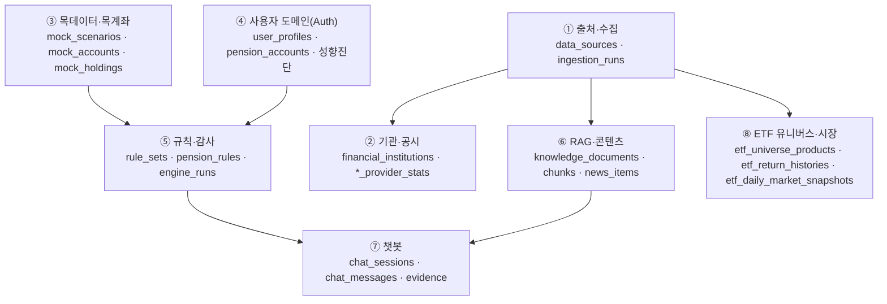
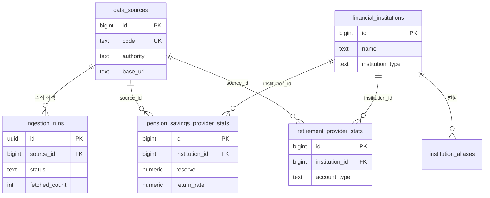
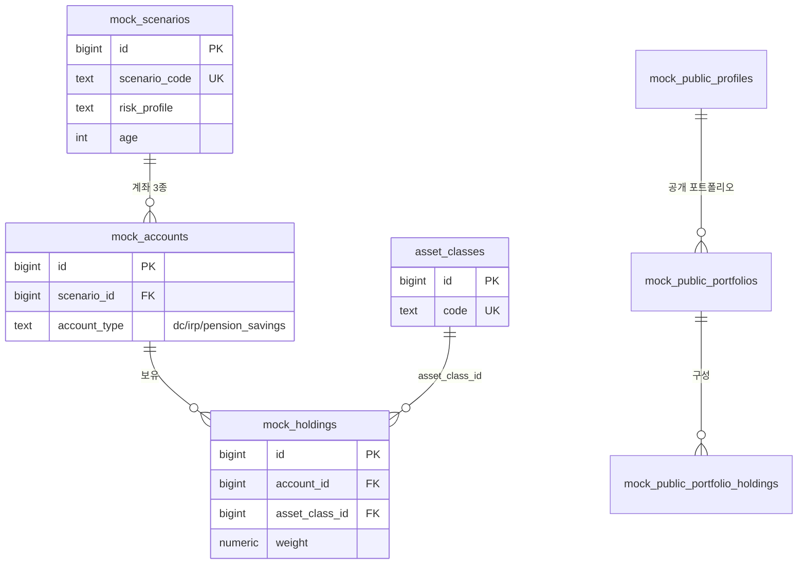
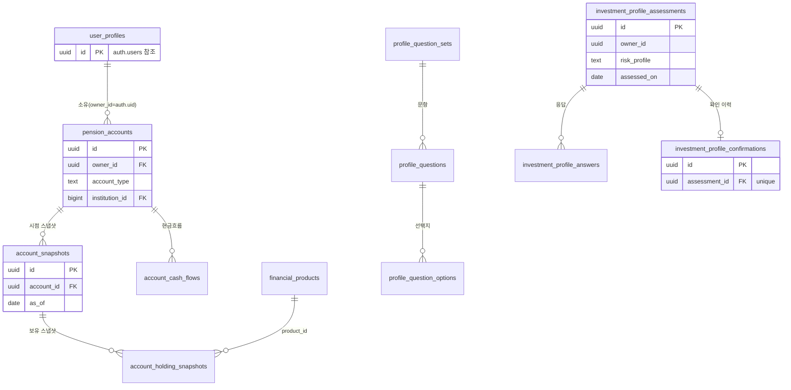
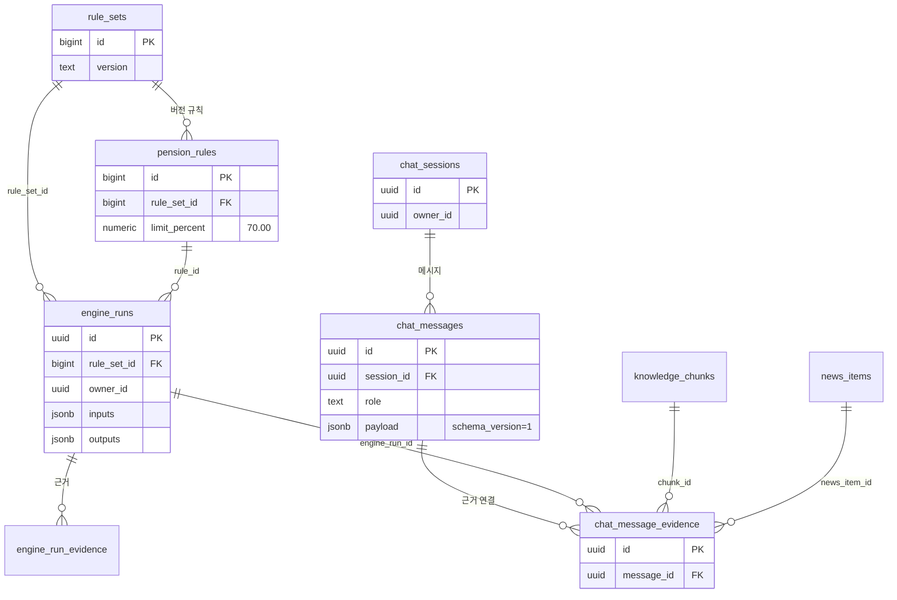
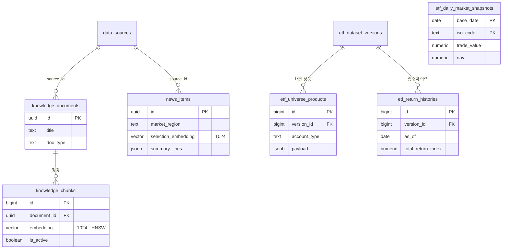

# 연금 코파일럿 — 데이터 ERD / 구조도 (Appendix)

> 작성일: 2026-07-22 · Supabase PostgreSQL public 스키마(49개 기본 테이블, 마이그레이션 27개) 기준.
> 근거: `supabase/migrations/*` 실제 정의. 모든 public 테이블은 RLS 활성화, 내부 전용 테이블은 `service_role`만 grant.
> 가독성을 위해 논리 그룹별로 분할했다. 컬럼은 대표 키·식별자 위주로 축약(전체 컬럼은 마이그레이션 SQL 참조).

---

## 1. 전체 그룹 지도

---

## 2. 출처·수집 + 기관·공시

---

## 3. 목데이터·목계좌 + 공개 포트폴리오

---

## 4. 사용자 도메인 (Auth 연동 · 성향진단)

> 규칙: 소유자 정책 `(select auth.uid()) = owner_id`, real/mock 상호배타 CHECK. 목데이터는 여전히 `mock_scenarios` 계열이 SSOT(신규 사용자 테이블은 병행).

---

## 5. 규칙·감사 + 챗봇

---

## 6. RAG·콘텐츠 + ETF 유니버스·시장

---

## 7. 원격 주요 행 수 (2026-07-21 기준, `supabase/DB_HANDOFF.md`)

| 테이블 | 행 수 |
|---|---:|
| pension_savings_provider_stats | 88 |
| retirement_provider_stats | 126 |
| financial_institutions | 102 |
| knowledge_documents / 활성 임베딩 chunks | 15 / 56 |
| news_items | 15 |
| etf_daily_market_snapshots | 1,147 |
| etf_theme_content_reviews / evidence | 230 / 230 |
| mock_scenarios / accounts / holdings | 6 / 13 / 86 |
| benchmark_mock_users / accounts / holdings | 10,000 / 16,900 / 79,381 |
| profile_question_sets / questions / options | 1 / 6 / 30 |

> ETF 유니버스 원격 적재: 상품 2,507행(DC 823·IRP 823·연금저축 861), 총수익 이력 217,833행(기준일 2026-07-16).
