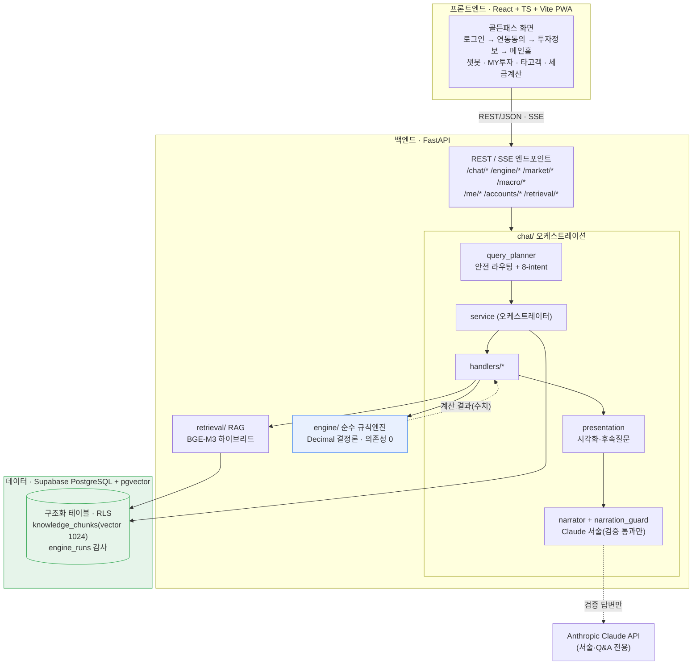
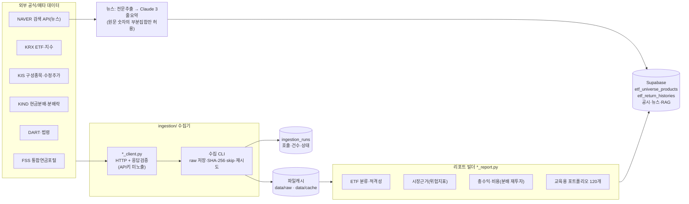
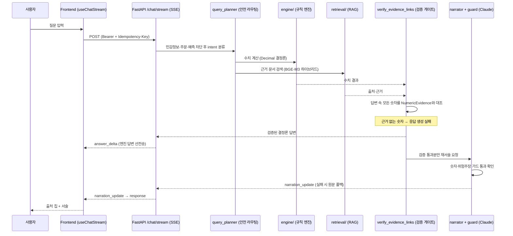
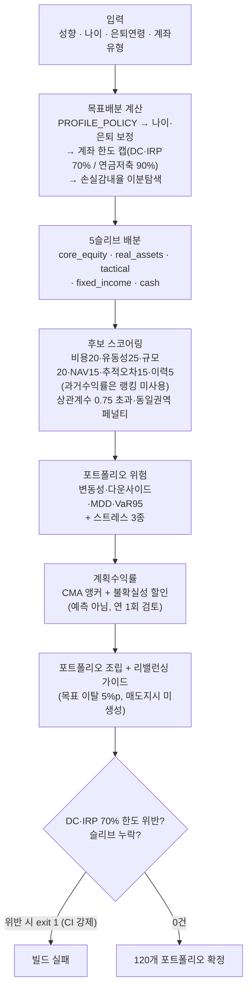
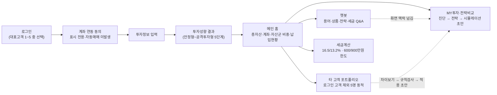

# 연금 코파일럿 — 발표용 다이어그램 모음

> 작성일: 2026-07-22 · 최종 대조: 2026-07-27(`main` `9502819`) · Mermaid 소스. GitHub/VS Code/Obsidian 등에서 렌더링되며, 슬라이드에는 렌더 이미지를 캡처해 사용한다.
> 근거: [아키텍처.md](../30_스펙/아키텍처.md)·[코드베이스_지도.md](../30_스펙/코드베이스_지도.md)의 실제 파일·엔드포인트에 맞춰 작성.

---

## 1. 시스템 아키텍처 (Tech Stack & 계층)

핵심: 의존은 `frontend → FastAPI → engine/data` 단방향. 엔진은 DB·네트워크·LLM에 의존하지 않는 순수 함수이고, LLM은 엔진이 낸 수치를 서술만 한다.

---

## 2. 데이터 수집 파이프라인 (수집 → 적재 → 서비스)

---

## 3. 모델 = 규칙 엔진 + 검증 게이트 위의 LLM (챗봇 1턴)

---

## 4. 교육용 포트폴리오 엔진 파이프라인 (성향 입력 → 포트폴리오)

---

## 5. 골든패스 유저플로우

---

## 6. API 엔드포인트 맵 (2026-07-27 실제 라우트 47개 기준)

| 그룹 | 메서드 · 경로 | 인증 | 역할 |
|---|---|---|---|
| system | `GET /` · `GET /health` | 공개 | 헬스체크 |
| engine | `POST /engine/risk-cap` | 공개 | 위험자산 70% 한도 판정 |
| engine | `POST /engine/risk-cap/audited` | 인증 | 같은 판정 + 규칙 버전 대조·`run_id` 감사 저장 |
| engine | `POST /engine/profile` · `/diagnostics` · `/aggregation` · `/allocation-example` | 공개 | 성향·진단·집계·배분예시 |
| engine | `POST /engine/pension-calculator` · `/pension-calculator/combined` · `/pension-calculator/portfolio-cma` | 공개 | 단일·계좌 합산 적립 시계열, 보유 포트폴리오 기반 CMA 계획수익률 |
| engine | `POST /engine/pension-tax-credit` · `/non-pension-withdrawal-estimate` | 공개 | 세액공제·연금외수령 추정 |
| engine | `POST /engine/etf-planning-return` · `/etf-planning-assessment` · `/educational-portfolio` | 공개 | ETF 계획수익률·평가·포트폴리오 예시 |
| engine | `GET /engine/strategy-planning-returns` | 공개 | 전략 5종 계획수익률 표시값 |
| engine | `GET /engine/mock-scenario/{scenario_code}` | 공개 | 목시나리오 엔진 평가 |
| chat | `POST /chat/stream` | 인증 | SSE 대화(Idempotency-Key 필수) |
| chat | `GET /chat/capabilities` · `/scenarios` · `/heroes` | 인증 | 기능·시나리오·대표고객 메타 |
| chat | `GET /chat/cards` | 공개 | 추천/후속질문 정적 카탈로그 |
| chat | `GET /chat/rebalancing-profile` | 인증 | 저장 성향·보유내역 기반 리밸런싱 점검 입력 |
| chat | `GET /chat/sessions` · `DELETE /chat/sessions` · `DELETE /chat/sessions/{id}` · `GET /chat/sessions/{id}/messages` | 인증 | 세션 목록·전체/개별 삭제·메시지 |
| chat | `GET /me/pension-context` | 인증 | 로그인 사용자 연금 컨텍스트 |
| accounts | `GET /accounts/link-options` | 공개 | 계좌 3종 정적 링크 메타(표시 전용) |
| accounts | `GET /me/pension-accounts` | 인증 | 사용자 연금계좌 스냅샷 |
| profile | `POST /me/investment-profile` · `GET /me/investment-profile` | 인증 | 투자성향 저장/조회(24개월 유효) |
| reminder | `GET /me/rebalancing-reminder` · `PUT` · `POST /me/rebalancing-reminder/complete` | 인증 | 리밸런싱 점검 주기 설정·조회·완료 기록(`review_available` 포함) |
| market | `GET /market/etfs` · `/market/etfs/{isu_code}/volume-history` · `/distribution-events` | 공개 | 전체 ETF 거래량·종목별 이력·분배금 이벤트 |
| macro | `GET /macro/evidence` · `/macro/analog-regimes` · `POST /macro/analog-regimes/etf-outcomes` | 공개 | 거시근거·과거 유사국면·ETF 사후성과 |
| retrieval | `GET /retrieval/knowledge` · `/retrieval/news` | 공개 | RAG 검색·뉴스 목록 |
| disclosures | `GET /disclosures/pension-savings` · `/retirement` | 공개 | FSS 공시 최신분기 |
| benchmark | `GET /benchmark/summary` | 공개 | 익명 벤치마크 집계 |

> 전체 스키마는 서버 실행 후 `http://127.0.0.1:8000/docs`(OpenAPI)에서 확인.
