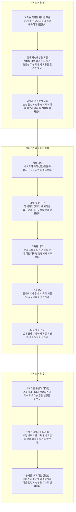
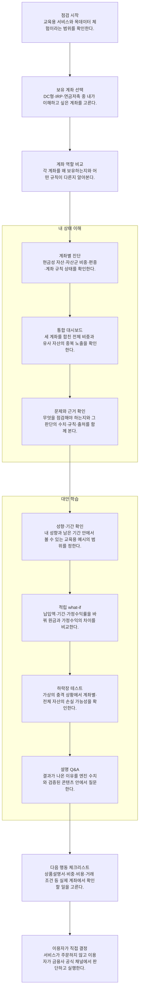
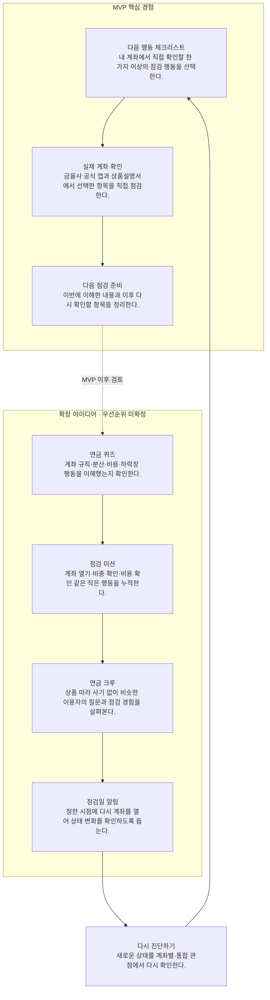

# 사용자 관점 연금 서비스 경험 흐름

> 기준: `연금계좌_운용가이드_프로젝트_기획서.md` v2.1 · 확장 아이디어: `보다_가까워지는_연금_서비스_개요.md`

## 1. 사용자가 경험하는 변화

```mermaid
%%{init: { "flowchart": { "padding": 38, "nodeSpacing": 125, "rankSpacing": 125, "inheritDir": true } } }%%
flowchart TB
    subgraph BEFORE["서비스 이용 전"]
        direction TB
        A1["계좌는 있지만 차이를 모름<br/>DC형·IRP·연금저축의 역할과 규칙이 헷갈린다."]
        A2["전체 자산구성을 모름<br/>계좌를 따로 봐서 주식·채권·현금성 자산의 전체 비중을 알기 어렵다."]
        A3["어떻게 점검할지 모름<br/>손실 불안과 상품 선택의 어려움 때문에 납입 후 계좌를 방치한다."]
    end

    subgraph SERVICE["서비스가 제공하는 경험"]
        direction TB
        B1["계좌 이해<br/>세 계좌의 목적·납입·인출·위험자산 규칙 차이를 비교한다."]
        B2["개별·통합 진단<br/>각 계좌의 상태와 세 계좌를 합친 전체 자산구성을 함께 확인한다."]
        B3["교육용 비교<br/>현재 상태와 다른 가정을 장기 적립·하락장 관점에서 비교한다."]
        B4["근거 확인<br/>결과에 사용된 수치·규칙·기준일·공식 출처를 확인한다."]
        B5["다음 행동 선택<br/>실제 금융사 앱에서 직접 확인할 점검 항목을 고른다."]
    end

    subgraph AFTER["서비스 이용 후"]
        direction TB
        C1["내 계좌를 구분해 이해함<br/>계좌마다 역할과 적용되는 제약이 다르다는 점을 설명할 수 있다."]
        C2["전체 연금자산을 함께 봄<br/>개별 계좌의 문제와 전체 자산의 편중·중복을 함께 파악한다."]
        C3["근거를 보고 직접 결정함<br/>서비스의 주문 없이 이용자가 다음 점검과 실행을 스스로 선택한다."]
    end

    A1 --> A2 --> A3 --> B1 --> B2 --> B3 --> B4 --> B5 --> C1 --> C2 --> C3
```

## 2. 서비스 이용 여정

```mermaid
%%{init: { "flowchart": { "padding": 38, "nodeSpacing": 125, "rankSpacing": 125, "inheritDir": true } } }%%
flowchart TB
    A["점검 시작<br/>교육용 서비스와 목데이터 체험이라는 범위를 확인한다."]
    B["보유 계좌 선택<br/>DC형·IRP·연금저축 중 내가 이해하고 싶은 계좌를 고른다."]
    C["계좌 역할 비교<br/>각 계좌를 왜 보유하는지와 어떤 규칙이 다른지 알아본다."]

    subgraph DIAGNOSIS["내 상태 이해"]
        direction TB
        D["계좌별 진단<br/>현금성 자산·자산군 비중·편중·계좌 규칙 상태를 확인한다."]
        E["통합 대시보드<br/>세 계좌를 합친 전체 비중과 유사 자산의 중복 노출을 확인한다."]
        F["문제와 근거 확인<br/>무엇을 점검해야 하는지와 그 판단의 수치·규칙·출처를 함께 본다."]
    end

    subgraph LEARNING["대안 학습"]
        direction TB
        G["성향·기간 확인<br/>내 성향과 남은 기간 안에서 볼 수 있는 교육용 예시의 범위를 정한다."]
        H["적립 what-if<br/>납입액·기간·가정수익률을 바꿔 원금과 가정수익의 차이를 비교한다."]
        I["하락장 테스트<br/>가상의 충격 상황에서 계좌별·전체 자산의 손실 가능성을 확인한다."]
        J["설명 Q&A<br/>결과가 나온 이유를 엔진 수치와 검증된 콘텐츠 안에서 질문한다."]
    end

    K["다음 행동 체크리스트<br/>상품설명서·비중·비용·거래 조건 등 실제 계좌에서 확인할 일을 고른다."]
    L["이용자가 직접 결정<br/>서비스가 주문하지 않고 이용자가 금융사 공식 채널에서 판단하고 실행한다."]

    A --> B --> C --> D --> E --> F --> G --> H --> I --> J --> K --> L
```

## 3. 반복 점검과 습관 형성

```mermaid
%%{init: { "flowchart": { "padding": 38, "nodeSpacing": 125, "rankSpacing": 125, "inheritDir": true } } }%%
flowchart TB
    subgraph MVP["MVP 핵심 경험"]
        direction TB
        A["다음 행동 체크리스트<br/>내 계좌에서 직접 확인할 한 가지 이상의 점검 행동을 선택한다."]
        B["실제 계좌 확인<br/>금융사 공식 앱과 상품설명서에서 선택한 항목을 직접 점검한다."]
        C["다음 점검 준비<br/>이번에 이해한 내용과 이후 다시 확인할 항목을 정리한다."]
    end

    subgraph EXPANSION["확장 아이디어 · 우선순위 미확정"]
        direction TB
        D["연금 퀴즈<br/>계좌 규칙·분산·비용·하락장 행동을 이해했는지 확인한다."]
        E["점검 미션<br/>계좌 열기·비중 확인·비용 확인 같은 작은 행동을 누적한다."]
        F["연금 크루<br/>상품 따라 사기 없이 비슷한 이용자의 질문과 점검 경험을 살펴본다."]
        G["점검일 알림<br/>정한 시점에 다시 계좌를 열어 상태 변화를 확인하도록 돕는다."]
    end

    H["다시 진단하기<br/>새로운 상태를 계좌별·통합 관점에서 다시 확인한다."]

    A --> B --> C
    C -. MVP 이후 검토 .-> D
    D --> E --> F --> G --> H
    H --> A
```
