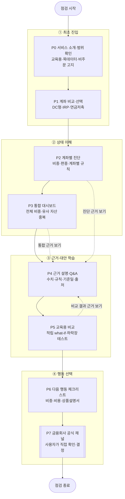
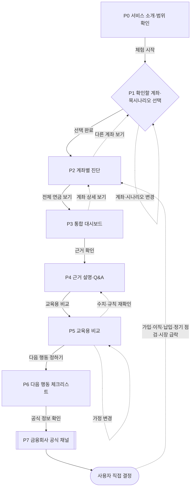
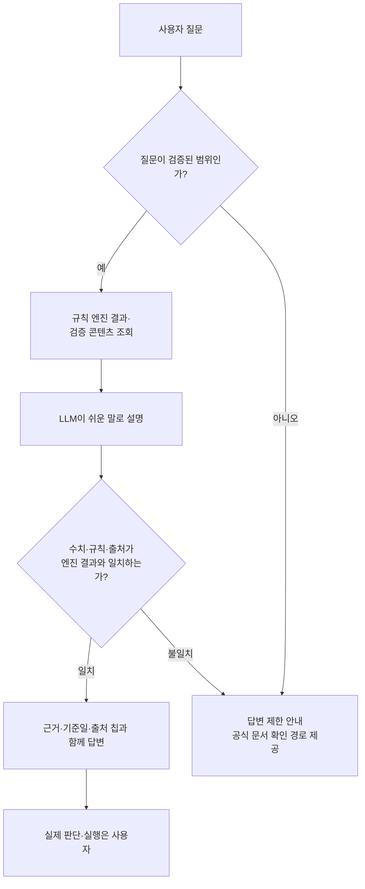

# 사용자 관점 연금 서비스 경험 흐름

> 기준: [프로젝트 기획서](./연금계좌_운용가이드_프로젝트_기획서.md) v2.1
>
> 목적: 모바일 연금 코파일럿의 화면 구조와 사용자 이동을 한눈에 파악한다.
>
> 범위: MVP 정보구조 초안. 하단 탭·화면 명칭·세부 UI는 구현 전 확정이 필요하다.

## 1. 전체 화면 구조

화면은 **최초 진입 → 상태 이해 → 근거·대안 학습 → 행동 선택**으로 이어진다. `P7`은 서비스 내부 주문 화면이 아니라 금융회사 공식 채널에서 사용자가 직접 확인하는 서비스 밖 단계다.

```text
[최초 진입]
P0 서비스 소개·범위 확인
P1 계좌 비교·선택

[핵심 진단]
P2 계좌별 진단
P3 통합 대시보드

[근거·대안 학습]
P4 근거 설명·Q&A
P5 교육용 비교

[행동 연결]
P6 다음 행동 체크리스트
P7 공식 채널 확인·사용자 직접 결정  ← 서비스 밖
```

### 화면 관계 한눈에 보기



---

## 2. 사용자 전체 플로우맵

실선은 MVP 골든패스다. 점선은 다시 선택하거나 근거를 재확인하는 보조 흐름이다.



### 핵심 플로우 요약

| 구분 | 이동 | 사용자가 얻는 것 |
|---|---|---|
| 최초 진입 | P0 → P1 | 서비스 범위와 세 계좌의 차이 이해 |
| 개별 상태 확인 | P1 → P2 | 계좌별 비중·편중·적용 규칙 확인 |
| 전체 상태 확인 | P2 → P3 | 세 계좌 합산 비중과 중복 노출 확인 |
| 근거 확인 | P3 → P4 | 결과에 사용된 수치·규칙·출처 확인 |
| 교육용 비교 | P4 → P5 | 가정 변화와 손실 가능성을 함께 비교 |
| 행동 선택 | P5 → P6 | 실제 계좌에서 점검할 항목 선택 |
| 직접 결정 | P6 → P7 | 공식 정보 확인 후 사용자가 최종 판단 |

---

## 3. 화면별 진입·이탈과 핵심 CTA

| 화면 | 목적 | 들어오는 경로 | 핵심 CTA | 나가는 경로 |
|---|---|---|---|---|
| P0 서비스 소개·범위 확인 | 대상 계좌와 서비스 한계 이해 | 최초 진입 | `체험 시작` | P1 |
| P1 계좌 비교·선택 | 계좌 역할 비교와 목시나리오 선택 | P0 / P2에서 변경 | `이 계좌로 진단하기` | P2 |
| P2 계좌별 진단 | 각 계좌의 비중·편중·규칙 상태 확인 | P1 / P3 상세 보기 / 재방문 | `전체 연금 보기` | P3 / P4 / P1 |
| P3 통합 대시보드 | 세 계좌 합산 구성과 중복 확인 | P2 | `왜 이런 결과인가요?` | P4 / P2 |
| P4 근거 설명·Q&A | 엔진 수치·규칙·기준일·출처 확인 | P2 / P3 / P5 | `교육용 비교하기` | P5 / 이전 화면 |
| P5 교육용 비교 | 적립·충격 가정을 바꿔 효과와 위험 비교 | P4 | `다음 행동 정하기` | P6 / P4 |
| P6 다음 행동 체크리스트 | 실제 계좌에서 확인할 일을 선택 | P5 | `공식 정보 확인하기` | P7 / P2 |
| P7 공식 채널 확인·직접 결정 | 상품설명서와 금융회사 정보를 직접 확인 | P6 | 서비스 내부 주문 CTA 없음 | 서비스 밖 / 이후 P2 재진단 |

### 화면별 한 가지 질문

| 화면 | 사용자가 답해야 하는 질문 |
|---|---|
| P0 | “이 서비스가 무엇을 하고, 무엇을 하지 않지?” |
| P1 | “어떤 계좌를 어떤 목시나리오로 볼까?” |
| P2 | “각 계좌에서 무엇을 점검해야 하지?” |
| P3 | “세 계좌를 합치면 어디에 편중됐지?” |
| P4 | “이 결과는 어떤 수치·규칙·출처에서 나왔지?” |
| P5 | “가정을 바꾸면 효과와 위험이 어떻게 달라지지?” |
| P6 | “실제 계좌에서 무엇부터 확인하지?” |
| P7 | “공식 정보를 보고 실제로 바꿀 필요가 있을까?” |

---

## 4. AI 설명과 규제 가드레일

AI는 계산하거나 주문하지 않는다. 규칙 엔진 결과를 설명하고, 답변 수치가 엔진 결과와 일치할 때만 사용자에게 보여준다.



반드시 지킬 화면 정책:

1. 모든 수치에 **기준일·출처 칩·실데이터/목데이터 라벨**을 표시한다.
2. DC형·IRP와 연금저축의 규칙을 분리하며, 성향 밖 교육 예시는 차단한다.
3. 시뮬레이션은 입력값·가정·손실 가능성을 함께 표시하고 확정 수익처럼 표현하지 않는다.
4. `추천 매수`, `자동 운용`, `원탭 주문` 같은 실행 오인 표현과 주문 버튼을 두지 않는다.
5. 최종 상품 선택과 실행은 P7의 금융회사 공식 채널에서 사용자가 직접 한다.

---

## 5. 예외·재진입 흐름

| 상황 | 처리 흐름 |
|---|---|
| 계좌 또는 목시나리오를 선택하지 않음 | P1에서 선택 안내 → 선택 완료 후 P2 |
| 진단 입력·규칙 데이터 오류 | 오류 원인과 영향 범위 표시 → 재시도 또는 P1 복귀 |
| Q&A가 검증 범위를 벗어남 | 답변을 추측하지 않음 → 한계 안내와 공식 출처 제공 |
| 교육용 예시가 계좌 규칙·성향을 위반함 | 결과 노출 차단 → 허용 범위 설명 후 입력 재설정 |
| 금융회사 공식 정보와 서비스 정보가 다름 | 공식 정보 우선 안내 → 기준일 확인 → 추후 데이터 갱신 대상 표시 |
| 실제 계좌 상태가 변함 | P7에서 실행하지 않고 변화 후 P2로 재진입해 다시 진단 |

재점검 계기는 다음과 같다.

- 퇴직연금 가입 또는 금융회사 이전
- 이직·퇴직으로 IRP에 퇴직급여 입금
- 연금계좌 추가 납입
- 분기·반기 정기 점검
- 시장 급락 또는 자산 비중 변화

---

## 6. MVP 밖 확장 아이디어

다음 기능은 핵심 흐름 검증 후 우선순위를 정한다.

- 연금 퀴즈: 계좌 규칙·분산·비용·하락장 행동 이해 확인
- 점검 미션: 계좌 열기·비중 확인·비용 확인 같은 작은 행동 누적
- 연금 크루: 상품 따라 사기 없이 질문과 점검 경험 공유
- 점검일 알림: 사용자가 정한 시점에 재진단 유도

상세 아이디어는 [보다 가까워지는 연금 서비스 개요](./보다_가까워지는_연금_서비스_개요.md)에서 관리한다. 기능 범위·완료 기준은 [프로젝트 기획서](./연금계좌_운용가이드_프로젝트_기획서.md), 규제 표현은 [금융권 규제 및 컴플라이언스 고려사항](./금융권%20규제%20및%20컴플라이언스%20고려사항.md)을 기준으로 한다.
